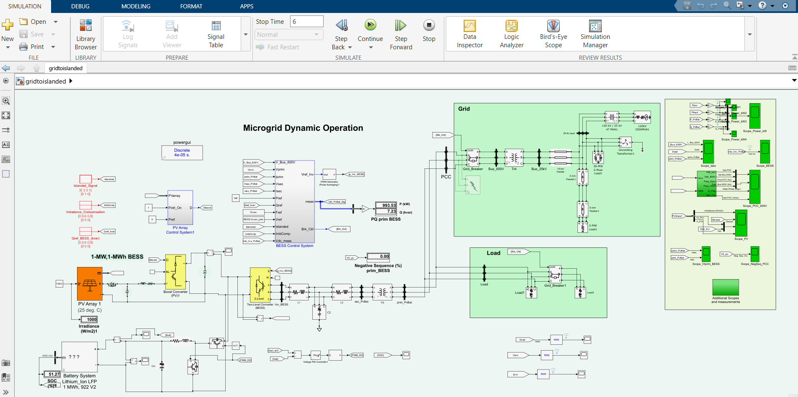

# Investigation of Robust Controller Design in Microgrid for effective power transfer 
This project portfolio presents the design and implementation of robust controllers in a solar-powered microgrid integrated with BESS and FPGA-based control logic.
## Technologies Used
- MATLAB / Simulink
- VHDL
- Xilinx FPGA
- Embedded Systems
- Power Electronics
- Power system
- Renewable energy
- Power system control algorithms

  # 📄 Project File
See `Dhikshanya_Project_Portfolio.pdf` for full project documentation.

# 📊 Simulation

### Simulink Model

### simulation of the work 

### simulation of the work 

## 💡 Project Summary

This project presents the modeling, simulation, and hardware implementation of a microgrid controller using VSM (Virtual Synchronous Machine) and Sliding Mode Control. It improves transient response and enhances inverter synchronization under various operating modes and faults.

## 👤 Author
Dhikshanya S  
EEE Graduate, SRMIST  
[LinkedIn Profile] (www.linkedin.com/in/dhikshanya20)
